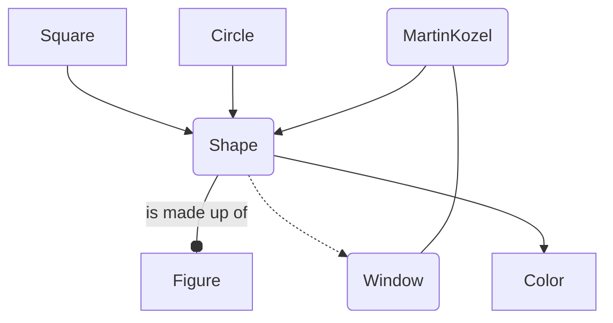

```mermaid


flowchart TD
    A[Square] --> E(Shape)
    B[Circle] -->E(Shape)
    E(Shape) --o |is made up of| C[Figure]
    D[MartinKozel] -->E(Shape) -.->G[Window]
    D(MartinKozel) --- G(Window)
    E --> F[Color]
```
